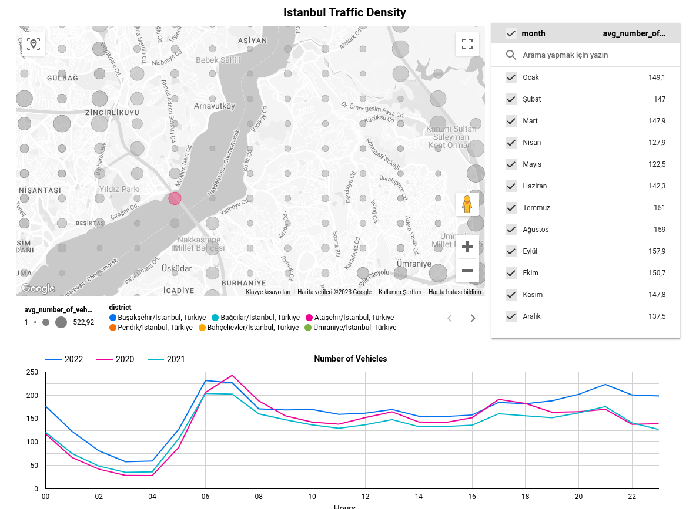
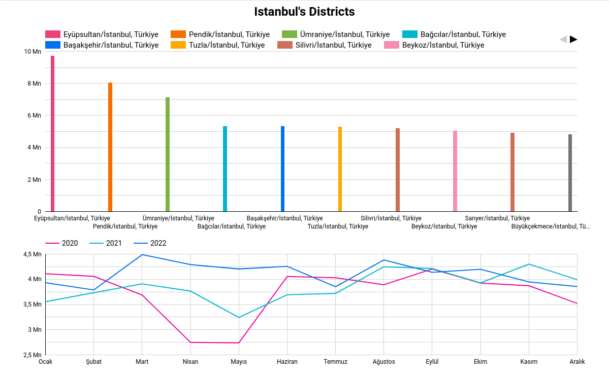

# Istanbul Traffic Density | Data Engineering Zoomcamp

This project is requirement of [Data Engineering Zoomcamp](https://github.com/DataTalksClub/data-engineering-zoomcamp). Building cloud services infrastructure, creating data ingestion pipeline, transforming data and as a reporting creating data dashboard.

## Project info

In this project we are looking Istanbul traffic density. The data I used was published by Istanbul City Hall open data platform. The content of the data is the traffic density of 5014 unique locations. Data was collected hourly for 3 (2019,2021,2022) year. Total data volume is 13.92 GB. In this project I will comparing the hours of the day, month and years and visualize locations on the looker dashboard with google maps integrations.
Here is raw data sample:

| date_time 	    | longitude 	 | latitude 	  | geohash 	| minimum_speed 	| maximum_speed 	| average_speed 	| number_of_vehicles 	|
|-----------	    |-----------	 |----------	  |---------	|---------------	|---------------	|---------------	|--------------------	|
|2020-01-01T00:00:00|28.8116455078125|41.0806274414063|sxk3xw      	|134              	|18               	|81               	|132                    |
|2020-01-01T00:00:00|29.1082763671875|40.9872436523438|sxk9nm     	|143             	|10               	|73               	|162                    |
|2020-01-01T00:00:00|29.0972900390625|41.0037231445313|sxk9q0   	|128              	|6               	|50               	|110                    |


## Processing of Data

For processing data I've extracted hours, month  and year information from timestamp column and saved as individual columns. Google looker studio accept geographic locations with "(latitude, longitude)" as format. I've concatenated latitude and logitude columns. Unfortunately data source does not provide geohash counterparts. For getting locations address I used google maps python library and saved location addresses another column. Istanbul has 39 district. For comparing each district I've extracted district information from address column. With processed data I can compare each hour, each month for 3 year.

Here is processed data:


|          date_time|year|month|hour|minimum_speed|maximum_speed|average_speed|number_of_vehicles|            district|geohash|         coordinates|            location|
|-------------------|----|-----|----|-------------|-------------|-------------|------------------|--------------------|-------|--------------------|--------------------|
|2022-08-05 03:00:00|2022|    8|   0|           81|           11|           41|                28|Eyüpsultan/İstanb...| sxk9d3|41.05316162109376...|Eyüp Merkez, 3405...|
|2022-08-05 03:00:00|2022|    8|   0|          109|           10|           65|                89|Üsküdar/İstanbul,...| sxk9m6|41.01470947265625...|Küçük Çamlıca, Çi...|
|2022-08-05 03:00:00|2022|    8|   0|          168|           13|           68|               245|Esenyurt/İstanbul...| sxk3s9|41.05316162109376...|Ardıçlı Mh., Yase...|

## Transforming of Data

For transforming data I created 2 dataframe. Transformed and processed data was saved to bigquery. Processed data was partitioned on a monthly basis.

Average dataframe: With this dataframe I grouped coordinates, hour, month and year columns. While grouping calculated average of all numeric variables for each group. Hours, months and years can be visualized as time series for each location.

District dataframe: With this dataframe I grouped district, year and month colums. While grouping calculated average of all numeric variables for each group. Months and years can be visualized as time series for each district.

## Project Architecture


### Dataproc Jobs:

* Dataproc Job 1: This is web to cloud storage script. Fetches data from web, turns pyspark dataframe and transform necessary changes
* Dataproc Job 2: This is process script. Takes all data from cloud storage, processes data and saves to cloud storage.
* Dataproc Job 3: This is transform script. Takes processed data from cloud storage and transform data for reporting and saves to bigquery.

## Technology Stack:

* Data Cluster: Dataproc
* Data Lake: Google Cloud Storage
* Data Warehouse: Google BigQuery
* Data Dashboard: Google Looker Studio
* Orchestrating: Prefect and Prefect Cloud
* Frameworks: Spark, Pyspark jobs
* Infrastructure as code tool: Terraform

## Running project

Running project pretty easy with makefile. You can follow instructions:

### Requirements
- Google Cloud Service Account key
- Prefect Cloud Account
- Terraform
### Requirement Details
* GCP Service account must have this roles:
    - BigQuery Admin
    - Dataproc Administrator
    - Service Account User
    - Service Usage Admin
    - Storage Admin
    - Storage Object Admin
    - Google Maps API Key: -> https://console.cloud.google.com/projectselector2/google/maps-apis/credentials?utm_source=Docs_Credentials

* Prefect Cloud Count:
    - Prefect API key -> https://app.prefect.cloud/my/profile
    - Prefect Workspace -> https://app.prefect.cloud/workspaces/create


### Instructions
```bash
git clone git@github.com:yusyel/de-project.git
```

After cloning github repo make sure you activate python environment.

```bash
make install
```
Make install command will be install prefect, prefect-gcp and google cloud  python packages.

```bash
make prepare
```
Make prepare command will be prompt prefect_key, prefect_workspace and google maps api key. After entering all variables make file will be create initialization script for GCP Dataproc that contains prefect_key, prefect_workspace id and google maps api.

```bash
make terraform
```
Make terraform command  will be initialization terraform and prompt GCP project id,  region and GCP service account key location.

With terraform this resources will be created:

* Google Cloud Storage
* Google Bigquery Dataset
* Google Dataproc Cluster
* Enabling Necessary APIs
* Transfer dataproc job scripts and initialization script to cloud storage


```bash
make flow
```
Make flow command will be prompt GCP project id and region. After that prefect flow will be trigger dataproc job scripts using google cloud python library. Whole ETL pipeline is running on GCP dataproc cluster machine.

## Dashboard
Google Looker Studio dashboard [report.](https://lookerstudio.google.com/reporting/49a43be5-0939-42b5-8028-15e5fab3253a)




